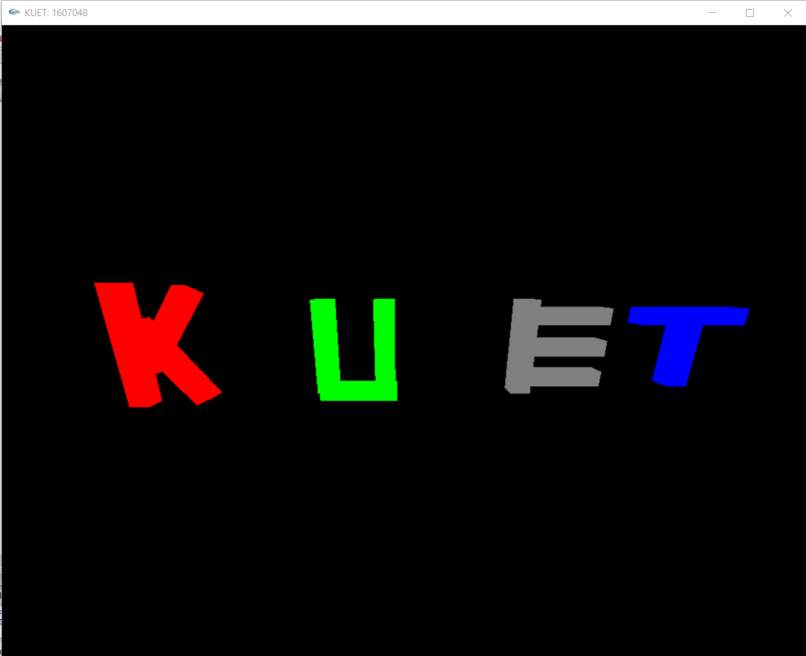
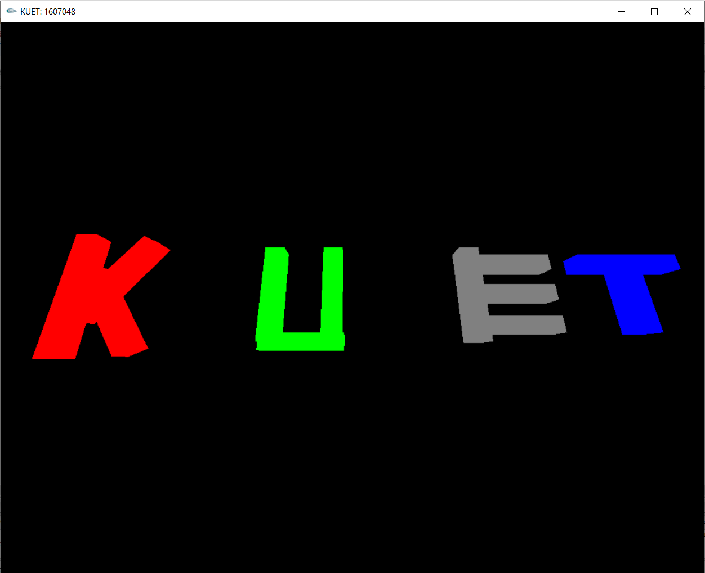
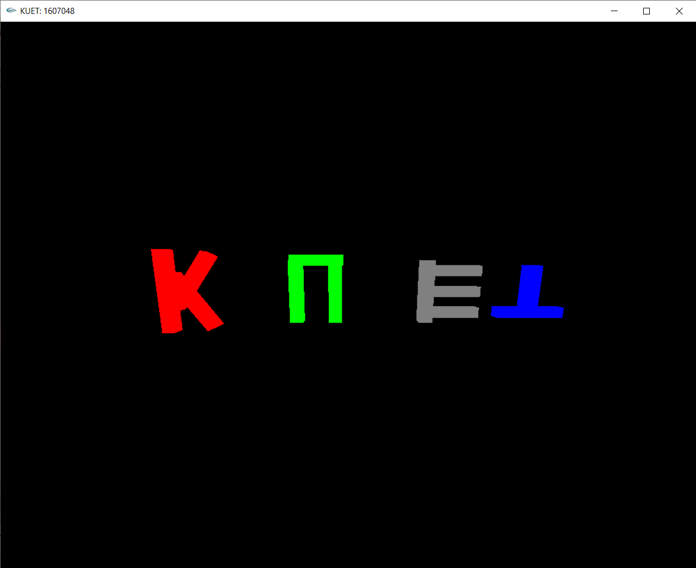

# Design-3D-KUET-Word-in-OpenGL-CPP
Design 3D KUET Word in OpenGL C++

Graphics Operation
- Rotation
- Scaling
- Translation
- Zoom in and out

<h2>1: Output of KUET word</h2>

<h2>2: Apply rotation with up and down </h2>

<h2>3: Apply rotation with left and right </h2>

<h2>4: Apply rotation with up and down and scene viewed from the back side of the object </h2>

